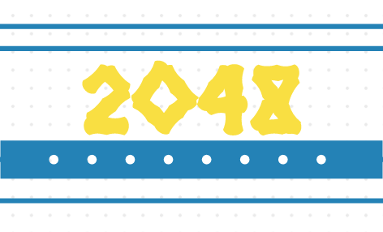

<div id="top"></div>


<!-- PROJECT SHIELDS -->
[![Contributors][contributors-shield]][contributors-url]
[![Forks][forks-shield]][forks-url]
[![Stargazers][stars-shield]][stars-url]
[![Issues][issues-shield]][issues-url]
[![MIT License][license-shield]][license-url]
[![LinkedIn][linkedin-shield]][linkedin-url]


<!-- PROJECT LOGO -->
<br />
<div align="center">
  <a href="https://github.com/0xecho/2048-er">
    
  </a>

<h3 align="center">2048'er</h3>

  <p align="center">
    A remake of the 2048-game but with a competitive programming twist.
    <br />
    <br />
    <br />
    <a href="http://18.221.250.94/">View Site</a>
    ·
    <a href="https://github.com/0xecho/2048-er/issues">Report Bug</a>
    ·
    <a href="https://github.com/0xecho/2048-er/issues">Request Feature</a>
  </p>
</div>


<!-- TABLE OF CONTENTS -->
<details>
  <summary>Table of Contents</summary>
  <ol>
    <li>
      <a href="#about-the-project">About The Project</a>
      <ul>
        <li><a href="#built-with">Built With</a></li>
      </ul>
    </li>
    <li>
      <a href="#getting-started">Getting Started</a>
      <ul>
        <li><a href="#prerequisites">Prerequisites</a></li>
        <li><a href="#installation">Installation</a></li>
      </ul>
    </li>
    <li><a href="#usage">Usage</a></li>
    <li><a href="#roadmap">Roadmap</a></li>
    <li><a href="#contributing">Contributing</a></li>
    <li><a href="#license">License</a></li>
    <li><a href="#contact">Contact</a></li>
  </ol>
</details>


<!-- ABOUT THE PROJECT -->
## About The Project

[![Product Name Screen Shot][product-screenshot]](https://example.com)
Join the tiles, get to _2048_. This time instead of you playing the game, unleash your bot minions to play on your behalf. Currently only supports Python. :-(

<p align="right">(<a href="#top">back to top</a>)</p>


### Built With

* [Django](https://www.djangoproject.com/)
* [Bootstrap](https://getbootstrap.com)

<p align="right">(<a href="#top">back to top</a>)</p>


<!-- GETTING STARTED -->
## Getting Started

To get a local copy up and running follow these simple example steps.

### Prerequisites

This is an example of how to list things you need to use the software and how to install them.
* pipenv
  ```sh	
  sudo apt install python3
  python3 -m pip install pipenv
  ```

### Installation

1. Clone the repo
   ```sh
   git clone https://github.com/0xecho/2048-er.git
   cd 2048-er
   ```
2. Install NPM packages
   ```sh
   pipenv install
   ```
3. Run locally
   ```sh
   pipenv run python3 manage.py runserver 0:8000
   ```

<p align="right">(<a href="#top">back to top</a>)</p>


<!-- ROADMAP -->
## Roadmap

- [] Refactor Judge Code
- [] Move Judge to a separate Dockerized subsystem
- [] Improve security
    - Enforce Time and Memory limits on running code
    - Disable/Remove potentially harmful modules
    - Disconnect running code from network
    - Create a restricted environment for code

See the [open issues](https://github.com/0xecho/2048-er/issues) for a full list of proposed features (and known issues).

<p align="right">(<a href="#top">back to top</a>)</p>


<!-- CONTRIBUTING -->
## Contributing

Contributions are what make the open source community such an amazing place to learn, inspire, and create. Any contributions you make are **greatly appreciated**.

If you have a suggestion that would make this better, please fork the repo and create a pull request. You can also simply open an issue with the tag "enhancement".
Don't forget to give the project a star! Thanks again!

1. Fork the Project
2. Create your Feature Branch (`git checkout -b feature/AmazingFeature`)
3. Commit your Changes (`git commit -m 'Add some AmazingFeature'`)
4. Push to the Branch (`git push origin feature/AmazingFeature`)
5. Open a Pull Request

<p align="right">(<a href="#top">back to top</a>)</p>


<!-- LICENSE -->
## License

Distributed under the MIT License. See `LICENSE.txt` for more information.

<p align="right">(<a href="#top">back to top</a>)</p>


<!-- CONTACT -->
## Contact

Elias Amha - [@oxecho](https://t.me/oxecho) - oxecho@wearehackerone.com

Project Link: [https://github.com/0xecho/2048-er](https://github.com/0xecho/2048-er)

<p align="right">(<a href="#top">back to top</a>)</p>


<!-- MARKDOWN LINKS & IMAGES -->
<!-- https://www.markdownguide.org/basic-syntax/#reference-style-links -->
[contributors-shield]: https://img.shields.io/github/contributors/0xecho/2048-er.svg?style=for-the-badge
[contributors-url]: https://github.com/0xecho/2048-er/graphs/contributors
[forks-shield]: https://img.shields.io/github/forks/0xecho/2048-er.svg?style=for-the-badge
[forks-url]: https://github.com/0xecho/2048-er/network/members
[stars-shield]: https://img.shields.io/github/stars/0xecho/2048-er.svg?style=for-the-badge
[stars-url]: https://github.com/0xecho/2048-er/stargazers
[issues-shield]: https://img.shields.io/github/issues/0xecho/2048-er.svg?style=for-the-badge
[issues-url]: https://github.com/0xecho/2048-er/issues
[license-shield]: https://img.shields.io/github/license/0xecho/2048-er.svg?style=for-the-badge
[license-url]: https://github.com/0xecho/2048-er/blob/master/LICENSE.txt
[linkedin-shield]: https://img.shields.io/badge/-LinkedIn-black.svg?style=for-the-badge&logo=linkedin&colorB=555
[linkedin-url]: https://linkedin.com/in/linkedin_username
[product-screenshot]: images/screenshot.png
